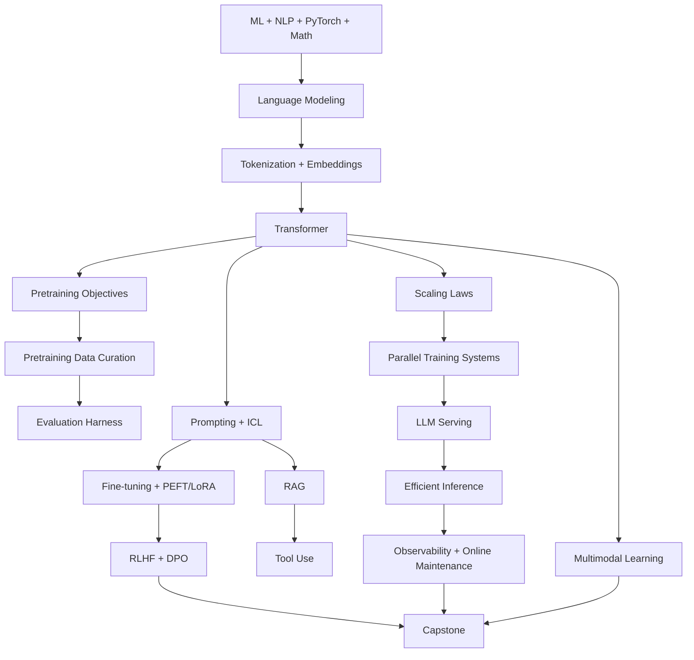
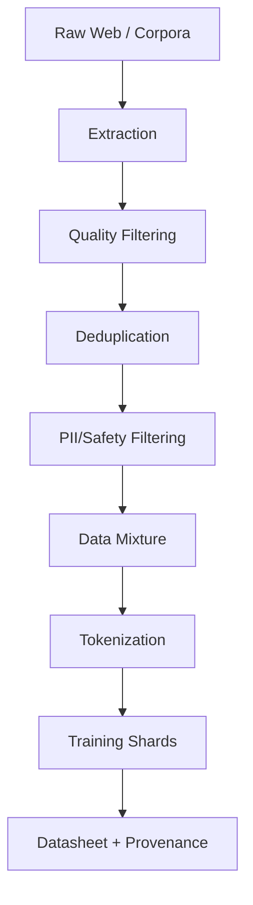
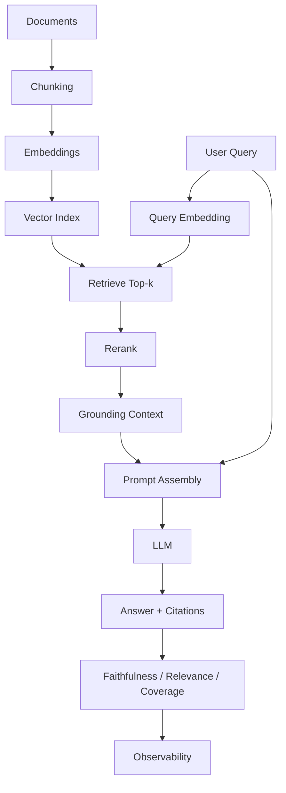
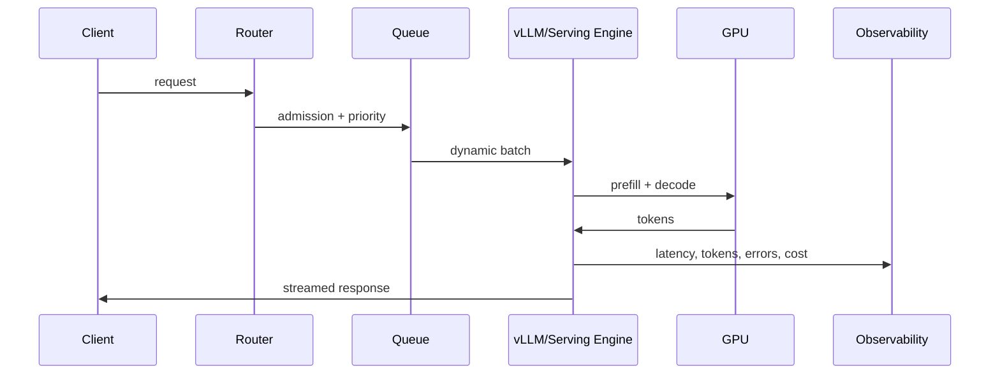
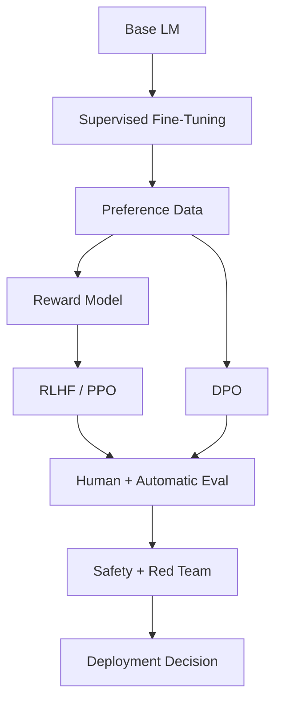
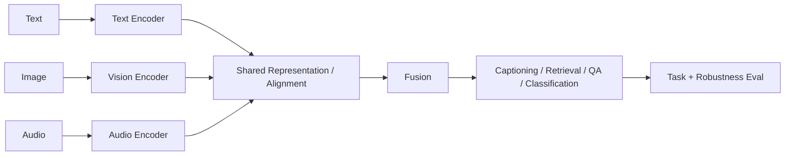
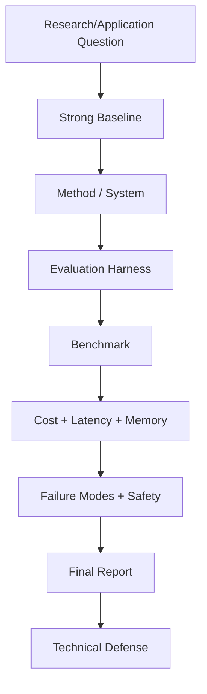

# 06 — Concept Map

## 1. Trilha Curricular

---

## 2. Transformer Internals

```mermaid
flowchart LR
    Tokens[Tokens] --> Embed[Token Embeddings]
    Embed --> Pos[Positional Encoding / RoPE]
    Pos --> Blocks[Transformer Blocks]
    Blocks --> Attn[Multi-Head Self-Attention]
    Attn --> MLP[Feed-forward / MLP]
    MLP --> Norm[LayerNorm + Residuals]
    Norm --> Logits[Logits]
    Logits --> Softmax[Softmax]
    Softmax --> Decode[Decoding]
```

---

## 3. Pretraining Data Pipeline

---

## 4. RAG Pipeline

---

## 5. LLM Serving Pipeline

---

## 6. Alignment Flow

---

## 7. Multimodal Learning

---

## 8. Capstone System

