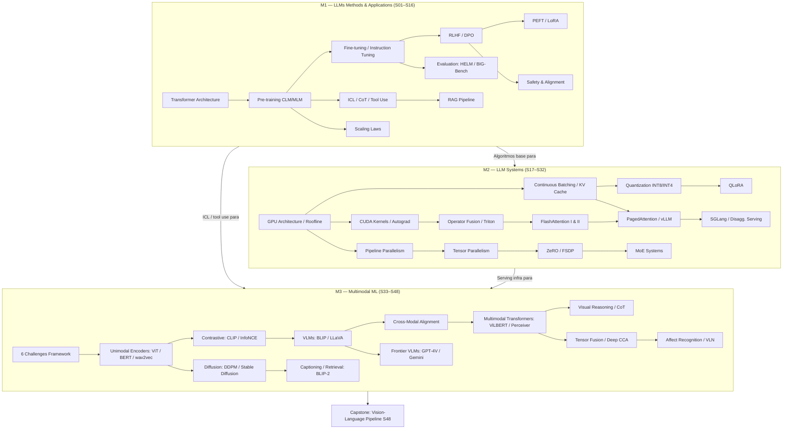
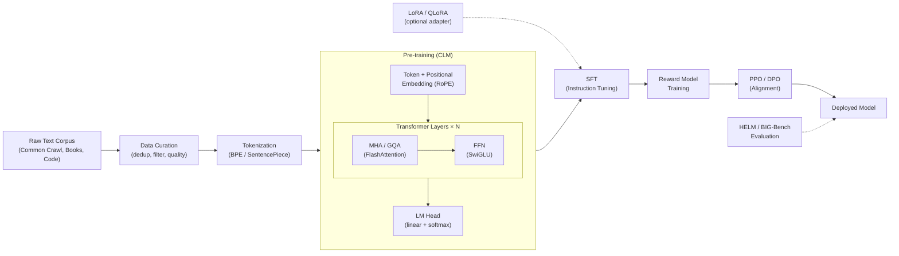
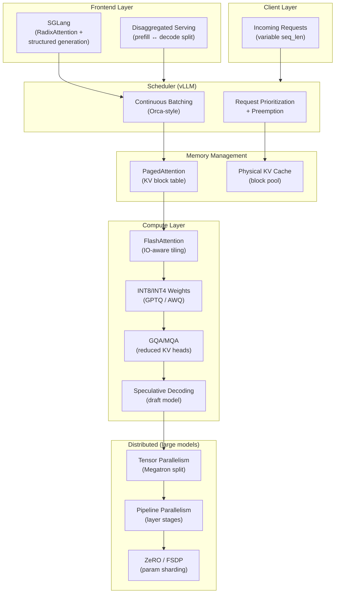
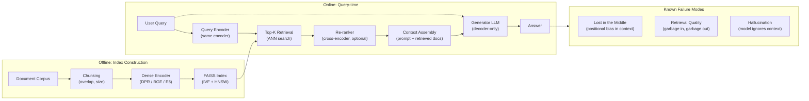
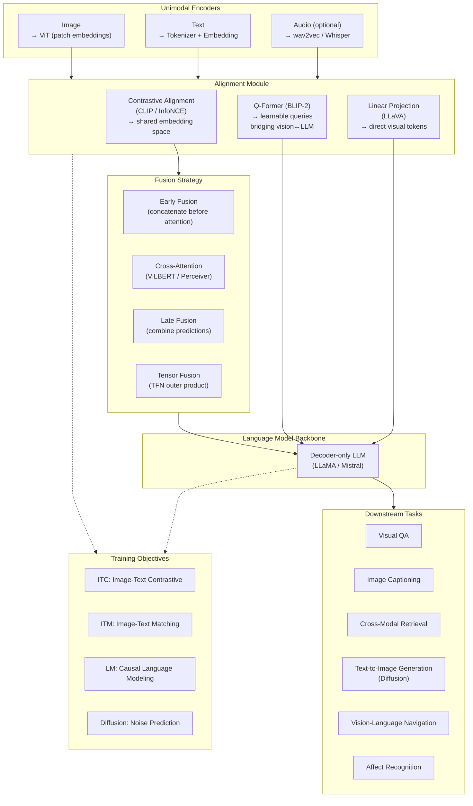

# Mapas Conceituais — CMU Generative AI & LLMs Kit

> 5 diagramas Mermaid cobrindo o stack completo do programa.

---

## Diagrama 1 — Certificate Program Stack (macro)

---

## Diagrama 2 — LLM Training Pipeline

---

## Diagrama 3 — LLM Systems Stack (Serving)

---

## Diagrama 4 — RAG Pipeline

---

## Diagrama 5 — Multimodal Architecture (Vision-Language)

