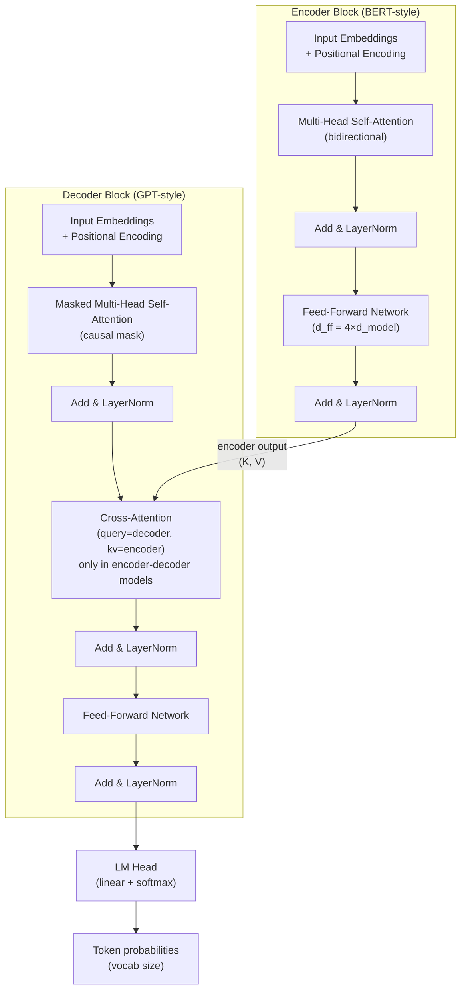

# Semana 01 — Building Blocks of Modern LLMs

> **Mapeia para:** 11-667 W01 — "Building blocks of modern LLMs; Transformer architecture; pre-training objectives"
> **Complexidade:** fundamentos
> **Tipo:** core
> **Fonte primária:** Vaswani et al. 2017 (NeurIPS); Devlin et al. 2019 (NAACL); Brown et al. 2020 (NeurIPS)

---

## Contexto e motivação

Em 2017, quase toda NLP de ponta usava LSTMs com atenção aditiva (Bahdanau 2015). O LSTM era o backbone universal: treina com BPTT, tem estado oculto sequencial, lida com sequências. O problema é que o estado oculto de tamanho fixo comprime informação de contexto longo de forma lossy, e o caráter sequencial impossibilita paralelização no tempo de treinamento.

O Transformer de Vaswani et al. resolve os dois problemas de uma vez. Cada token atende diretamente a todos os outros tokens (caminho de informação = 1 hop), e a computação por camada é completamente paralelizável. O custo é quadrático na sequência — mas para sequências usadas em 2017 (< 512 tokens), isso era aceitável, e CUDA é muito melhor em operações matriciais densas do que em loops sequenciais.

Esta semana cobre a arquitetura base que ainda é o fundamento de GPT-4, LLaMA-3, Gemini, e todo LLM moderno. O que mudou desde 2017 é: rotary positional embeddings, pre-layer normalization, SwiGLU FFN, GQA — mas o mecanismo de atenção central não mudou.

---

## Fundamentos formais

### Scaled Dot-Product Attention

Dados queries $Q \in \mathbb{R}^{n \times d_k}$, keys $K \in \mathbb{R}^{m \times d_k}$, values $V \in \mathbb{R}^{m \times d_v}$:

$$\text{Attention}(Q, K, V) = \text{softmax}\!\left(\frac{QK^\top}{\sqrt{d_k}}\right) V$$

**Por que dividir por $\sqrt{d_k}$?** Se $q$ e $k$ são vetores com componentes i.i.d. com média 0 e variância 1, o produto interno $q \cdot k = \sum_{i=1}^{d_k} q_i k_i$ tem variância $d_k$ (soma de $d_k$ termos com variância 1). Para $d_k = 512$, os dot products tipicamente chegam a $\pm 22$ antes da divisão, saturando o softmax em regiões de gradiente quase zero. O fator $\sqrt{d_k}$ normaliza os dot products para variância unitária.

**Softmax numericamente estável:** Na prática, computa-se:
$$\text{softmax}(z)_i = \frac{e^{z_i - \max(z)}}{\sum_j e^{z_j - \max(z)}}$$
O shift por $\max(z)$ não altera o resultado mas previne overflow.

**Complexidade:** $O(n^2 d_k)$ em tempo e $O(n^2)$ em memória para a matriz de atenção. Esse é o gargalo que FlashAttention (S29) resolve.

**Causal masking (decoder):** Para autoregressive generation, adiciona-se uma máscara triangular inferior antes do softmax:
$$\text{scores}_{ij} \leftarrow \text{scores}_{ij} - \infty \cdot \mathbf{1}[j > i]$$
Equivalente a $-10^9$ na prática (float impossível de exponentiar sem NaN).

---

### Multi-Head Attention (MHA)

Em vez de um único mecanismo de atenção, projeta-se $Q, K, V$ em $h$ subespações de dimensão $d_k = d_v = d_{\text{model}}/h$:

$$\text{MHA}(Q, K, V) = \text{Concat}(\text{head}_1, \ldots, \text{head}_h)\, W^O$$
$$\text{head}_i = \text{Attention}(QW_i^Q,\; KW_i^K,\; VW_i^V)$$

onde $W_i^Q, W_i^K \in \mathbb{R}^{d_{\text{model}} \times d_k}$, $W_i^V \in \mathbb{R}^{d_{\text{model}} \times d_v}$, $W^O \in \mathbb{R}^{h d_v \times d_{\text{model}}}$.

**Parâmetros de atenção** para um único bloco MHA com $d_{\text{model}} = 512$, $h = 8$:
- $W^Q + W^K + W^V$: $3 \times 512 \times 512 = 786{,}432$ parâmetros
- $W^O$: $512 \times 512 = 262{,}144$ parâmetros
- Total MHA: $\approx 1.05$M por bloco

**Por que múltiplas heads?** Cada head pode especializar-se em atender a tipos diferentes de relações (sintáticas, semânticas, posicionais). Elhage et al. 2021 mostrou que heads específicas atuam como "induction heads" que implementam cópia de padrão — comportamento emergente não-planejado.

---

### Feed-Forward Network (FFN)

Após a atenção, cada posição passa por uma FFN two-layer idêntica e independente:

$$\text{FFN}(x) = W_2 \cdot \text{ReLU}(W_1 x + b_1) + b_2$$

com $d_{ff} = 4 \times d_{\text{model}}$. Para $d_{\text{model}} = 512$: $W_1 \in \mathbb{R}^{512 \times 2048}$, $W_2 \in \mathbb{R}^{2048 \times 512}$. Parâmetros: $2 \times 512 \times 2048 = 2.1$M por bloco.

**Nota:** LLMs modernos (LLaMA, Mistral) substituem ReLU por SwiGLU: $\text{SwiGLU}(x, g) = (xW_1) \otimes \sigma(xW_3) \cdot W_2$, com 3 matrizes de peso. Evidência empírica de qualidade superior (Noam Shazeer, 2020).

---

### Positional Encoding (sinusoidal)

Transformers são permutation-invariant por design — sem positional encoding, "the cat sat" e "sat cat the" produziriam o mesmo output. O encoding original é determinístico:

$$\text{PE}(pos, 2i) = \sin\!\left(\frac{pos}{10000^{2i/d_{\text{model}}}}\right)$$
$$\text{PE}(pos, 2i+1) = \cos\!\left(\frac{pos}{10000^{2i/d_{\text{model}}}}\right)$$

**Propriedade chave:** $\text{PE}(pos + k)$ pode ser expresso como transformação linear de $\text{PE}(pos)$ para qualquer $k$ fixo, permitindo ao modelo generalizar para posições não vistas durante o treinamento. Frequências menores (baixo $i$) capturam relações locais; frequências maiores (alto $i$) capturam relações de longo alcance.

**Limitação:** Embeddings absolutos degradam para sequências maiores que o comprimento de treinamento. Por isso LLMs modernos usam RoPE (S02) ou ALiBi (S13).

---

### Layer Normalization e Residual Connections

**Post-LN (original Vaswani):**
$$\text{sublayer}(x) = \text{LayerNorm}(x + \text{Attention}(x))$$

**Pre-LN (LLaMA, Mistral, GPT-2+):**
$$\text{sublayer}(x) = x + \text{Attention}(\text{LayerNorm}(x))$$

Pre-LN tem gradientes mais estáveis — não há o problema de "gradient vanishing nos primeiros layers" que ocorre com Post-LN. **Esta é a razão pela qual todos os LLMs modernos usam Pre-LN.**

**Layer Norm:** normaliza por média e variância dentro de cada token (não por batch):
$$\text{LN}(x) = \frac{x - \mu}{\sigma} \odot \gamma + \beta$$
onde $\gamma, \beta \in \mathbb{R}^{d_{\text{model}}}$ são parâmetros aprendidos.

---

### Objetivos de pré-treinamento

**Causal Language Modeling (CLM) — decoder-only:**
$$\mathcal{L}_{\text{CLM}} = -\sum_{t=1}^{T} \log P_\theta(x_t \mid x_1, \ldots, x_{t-1})$$

Modelo prediz cada token dado o contexto anterior. Toda a atenção é unidirecional (causal mask). Permite geração autoregressiva. Usado por: GPT-1/2/3/4, LLaMA, Mistral, Claude.

**Masked Language Modeling (MLM) — encoder-only (BERT):**
$$\mathcal{L}_{\text{MLM}} = -\sum_{t \in \mathcal{M}} \log P_\theta(x_t \mid x_{\setminus \mathcal{M}})$$

15% dos tokens são mascarados; 80% substituídos por `[MASK]`, 10% por token aleatório, 10% mantidos. Atenção bidirecional. Representações mais ricas para classification. **Não permite geração direta.**

**Span Corruption (T5):** variante onde spans de tokens são mascarados e reconstruídos pelo decoder — combina benefícios de encoder bidirecional com decoder autoregressivo.

---

## Arquitetura e componentes



**Configuração do GPT-2 Small** (referência para os labs):

| Hyperparâmetro | Valor |
|---|---|
| $d_{\text{model}}$ | 768 |
| $n_{\text{heads}}$ | 12 |
| $d_k = d_{\text{model}}/n_h$ | 64 |
| $d_{ff}$ | 3072 (4×) |
| $n_{\text{layers}}$ | 12 |
| Parâmetros totais | ~117M |
| Vocab size | 50,257 (GPT-2 BPE) |

---

## Tradeoffs

| Característica | Transformer | LSTM | CNN (temporal) |
|---|---|---|---|
| Caminho máx. informação | $O(1)$ | $O(n)$ | $O(n/k)$ |
| Paralelismo (treino) | Total | Nenhum | Total |
| Complexidade por layer | $O(n^2 d)$ | $O(n d^2)$ | $O(k n d^2)$ |
| Memória | $O(n^2)$ (attention matrix) | $O(n d)$ | $O(n d)$ |
| Inductive bias | Nenhum | Localidade temporal | Localidade espacial |
| Performance seq. longa | Degrada (quadrático) | Degrada (vanishing) | Depende de $k$ |

**Quando o Transformer perde:** sequências muito longas ($n > 8192$ sem FlashAttention); hardware sem suporte a operações matriciais densas em lote; tasks onde inductive bias local é vantajoso (visão com convoluções antes de ViT).

---

## Limitações e failure modes

**Comprimento de contexto fixo:** O positional encoding original não generaliza bem para comprimentos maiores que os vistos em treinamento. Solução: RoPE (Su 2021), ALiBi (Press 2022), YaRN (Peng 2023).

**Quadrático em memória:** A matriz de atenção $n \times n$ precisa ser materializada em FP32/FP16. Para $n=32768$ tokens: $32768^2 \times 2 \text{ bytes} = 2$GB só pela matriz de atenção. FlashAttention (S29) resolve evitando a materialização.

**Falta de inductive bias de localidade:** Para vision e audio puro, CNNs superam Transformers em regimes de poucos dados (mas ViT supera com escala).

**Overfitting de label nos MLMs:** O truque de 10% de tokens não mascarados e 10% aleatórios em BERT foi empiricamente descoberto. Sem isso, o modelo "trapaceia" usando a informação da posição do `[MASK]`.

---

## Scaling e custo

**FLOPs por forward pass** de um transformer com $L$ layers, batch $B$, sequência $n$, $d_{\text{model}}$:

$$\text{FLOPs} \approx 2 \times L \times B \times n \times (12 d_{\text{model}}^2 + 2 n d_{\text{model}})$$

Fator 2: each multiply-add = 2 FLOPs. O termo $12 d_{\text{model}}^2$ domina para $n \ll d_{\text{model}}$; o termo $2n d_{\text{model}}$ domina para contextos muito longos.

**Memória do modelo** (FP16): $2 \times \text{parâmetros}$ bytes. GPT-2 Small: $117\text{M} \times 2 = 234$MB.

**Regra de bolso (Kaplan 2020):** Para treinar um modelo de $N$ parâmetros compute-optimally, use $\approx 20N$ tokens de dados.

---

## Implementação de referência

```python
import numpy as np
from typing import Optional

def softmax(x: np.ndarray, axis: int = -1) -> np.ndarray:
    # Numerically stable: subtract max before exp
    x = x - x.max(axis=axis, keepdims=True)
    exp_x = np.exp(x)
    return exp_x / exp_x.sum(axis=axis, keepdims=True)


def scaled_dot_product_attention(
    Q: np.ndarray,          # (batch, heads, seq_q, d_k)
    K: np.ndarray,          # (batch, heads, seq_k, d_k)
    V: np.ndarray,          # (batch, heads, seq_k, d_v)
    mask: Optional[np.ndarray] = None   # (batch, 1, seq_q, seq_k), True = KEEP
) -> tuple[np.ndarray, np.ndarray]:
    d_k = Q.shape[-1]

    # Dot-product scaled by sqrt(d_k) to prevent softmax saturation
    scores = Q @ K.swapaxes(-2, -1) / np.sqrt(d_k)   # (batch, heads, seq_q, seq_k)

    if mask is not None:
        # Replace masked positions with -inf so they get ~0 weight after softmax
        scores = np.where(mask, scores, -1e9)

    weights = softmax(scores, axis=-1)   # (batch, heads, seq_q, seq_k)
    output = weights @ V                  # (batch, heads, seq_q, d_v)
    return output, weights


class MultiHeadSelfAttention:
    """Single-layer MHA in NumPy. All weights initialized randomly."""

    def __init__(self, d_model: int, n_heads: int, seed: int = 42):
        assert d_model % n_heads == 0
        rng = np.random.default_rng(seed)
        scale = np.sqrt(2.0 / d_model)   # Xavier-like init

        self.d_model = d_model
        self.n_heads = n_heads
        self.d_k = d_model // n_heads

        # Each projection is (d_model, d_model); we'll split by head at runtime
        self.W_Q = rng.normal(0, scale, (d_model, d_model))
        self.W_K = rng.normal(0, scale, (d_model, d_model))
        self.W_V = rng.normal(0, scale, (d_model, d_model))
        self.W_O = rng.normal(0, scale, (d_model, d_model))

    def _split_heads(self, x: np.ndarray) -> np.ndarray:
        """(batch, seq, d_model) → (batch, n_heads, seq, d_k)"""
        B, S, _ = x.shape
        x = x.reshape(B, S, self.n_heads, self.d_k)
        return x.transpose(0, 2, 1, 3)

    def __call__(
        self,
        x: np.ndarray,                      # (batch, seq, d_model)
        mask: Optional[np.ndarray] = None
    ) -> tuple[np.ndarray, np.ndarray]:
        B, S, _ = x.shape

        Q = (x @ self.W_Q)   # (batch, seq, d_model)
        K = (x @ self.W_K)
        V = (x @ self.W_V)

        Q = self._split_heads(Q)   # (batch, n_heads, seq, d_k)
        K = self._split_heads(K)
        V = self._split_heads(V)

        attn_out, weights = scaled_dot_product_attention(Q, K, V, mask)
        # (batch, n_heads, seq, d_k) → (batch, seq, d_model)
        attn_out = attn_out.transpose(0, 2, 1, 3).reshape(B, S, self.d_model)

        output = attn_out @ self.W_O
        return output, weights
```

**Ponto crítico:** O código acima usa NumPy puro — sem autograd, sem GPU. O objetivo é verificar a mecânica, não a performance. A comparação com `nn.MultiheadAttention` do PyTorch valida a implementação antes de confiar em frameworks.

---

## Conexão com semanas anteriores e futuras

**← Pré-requisito:** Álgebra linear (produto matricial, autovalores). Probabilidade (softmax como distribuição). Python fluente com NumPy.

**→ S02:** Substitui sinusoidal PE por RoPE; substitui LayerNorm por RMSNorm; adiciona GQA. Tokenização (BPE) como primeiro passo do pipeline.

**→ S07:** Profiling e paralelismo — o custo quadrático identificado aqui é o que motiva gradient checkpointing, mixed precision, e distributed training.

**→ S17–S29 (M2):** FlashAttention reescreve a computação de atenção desta semana para evitar materializar a matriz $n \times n$ em HBM.

---

## Síntese (≤ 150 palavras)

O Transformer substitui recorrência por atenção: cada token atende diretamente a todos os outros em $O(1)$ hops, ao custo de complexidade quadrática em sequência. O mecanismo central — scaled dot-product attention — computa $\text{softmax}(QK^\top/\sqrt{d_k})V$, onde o fator $\sqrt{d_k}$ previne saturação do softmax em alta dimensionalidade. Multi-head attention projeta os tokens em $h$ subespações independentes, permitindo atenção simultânea a diferentes tipos de relação. Pre-LN (norma antes da atenção) é preferível ao Post-LN do paper original por estabilidade de gradiente. Para geração autoregressiva, causal masking bloqueia tokens futuros. O objective CLM ($-\log P(x_t|x_{<t})$) treina modelos decoder-only; MLM treina encoders bidirecionais. Toda arquitetura LLM moderna é variação destes componentes.
