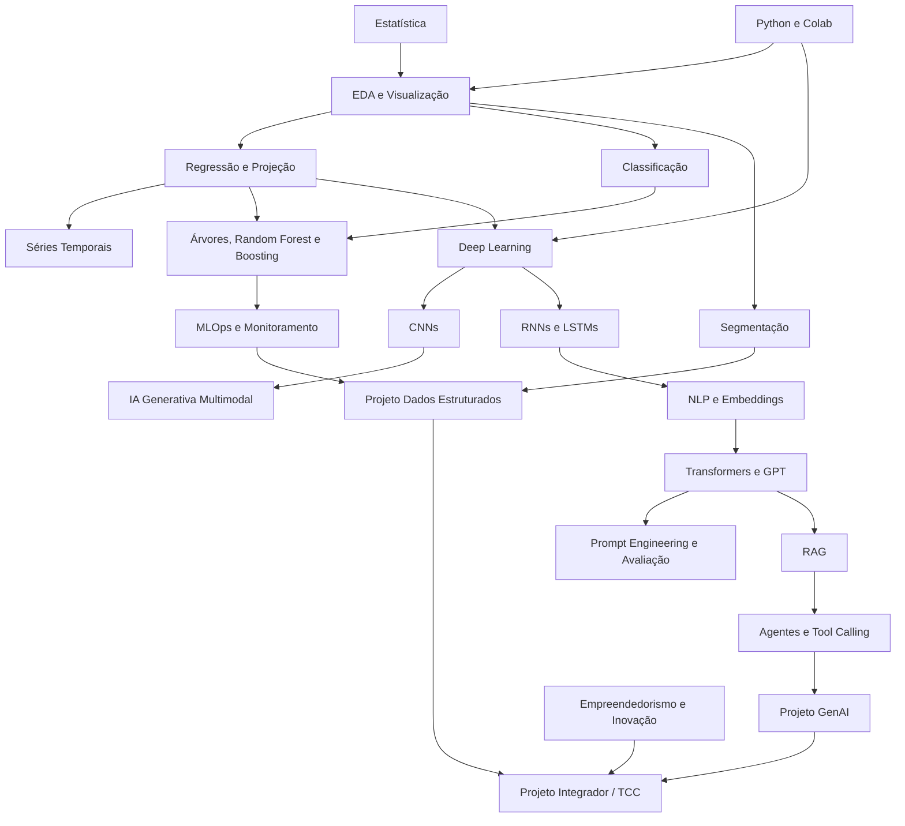

# Curriculum — FIA Business School / Labdata FIA — Analytics e IA — Data Science

Este arquivo reorganiza a matriz curricular oficial em módulos pedagógicos para uso autodidata. A fonte canônica permanece em `kit-estudo-especializacao/curriculum-source/curriculum.md`; este arquivo é a versão anotada para execução do kit.

---

## Fontes Oficiais Usadas

- Página oficial FIA: <https://fia.com.br/pos-graduacao-ead/analytics-inteligencia-artificial-data-science/>
- Página oficial Labdata FIA: <https://labdata.fia.com.br/curso/pos-analytics-e-inteligencia-artificial-data-science-ao-vivo/>
- PDF oficial FIA/Labdata 2025: <https://fia.com.br/wp-content/uploads/2025/05/CP-LABDATA-Pos_Analytics-e-IA-Data-Science-2025.pdf>
- PDF oficial FIA 2026: <https://fia.com.br/wp-content/uploads/2026/03/Pos-Graduacao-%E2%80%A8Analytics-e-Inteligencia-Artificial-%E2%80%93-Data-Science.pdf>

---

## Dados do Programa Oficial

| Campo | Valor |
|---|---|
| Nome | Pós-Graduação Analytics e Inteligência Artificial — Data Science |
| Instituição | FIA Business School / Labdata FIA |
| Modalidade | EAD 100% ao vivo |
| Carga horária | 360 horas |
| Duração | 16 meses |
| Coordenação geral | Profª Drª Alessandra de Ávila Montini |
| Aprovação | Frequência mínima 75%, nota mínima 7,0 em cada disciplina e TCC/trabalho final |

---

## Observações de Fidelidade

- A fonte oficial publica carga total, mas não distribui horas por disciplina.
- A fonte pública não publica bibliografia oficial por disciplina.
- A fonte pública não publica docentes por disciplina.
- A fonte pública não publica sequência semanal completa.
- A sequência abaixo é uma decomposição pedagógica inferida a partir da matriz oficial.

---

## Módulo 1 — Técnicas para Análise de Dados Estruturados

### 1. Fundamentos de Ciência de Dados, Analytics, IA e Transformação Digital

**Nível:** fundamentos  
**Dependências:** matemática básica, leitura técnica, lógica de análise  
**Papel no programa:** estabelecer vocabulário e visão sistêmica.

Tópicos:

- Ciência de Dados, Analytics e Inteligência Artificial.
- Machine Learning, Deep Learning e GenAI.
- Casos de uso corporativos e acadêmicos.
- Transformação digital.
- Estatística descritiva e inferencial.
- População, amostra e tipos de variáveis.

### 2. Python e Estruturação de Dados

**Nível:** fundamentos  
**Dependências:** lógica de programação  
**Papel no programa:** transformar conhecimento estatístico em análise executável.

Tópicos:

- Google Colab.
- Objetos, cálculos, funções, listas, vetores e bibliotecas.
- Criação e leitura de bases.
- Tipagem, variáveis-chave, filtros, agregações e joins.

### 3. Análise Exploratória e Visualização

**Nível:** fundamentos/intermediário  
**Dependências:** estatística + Python  
**Papel no programa:** construir diagnóstico de dados antes de modelagem.

Tópicos:

- Tratamento de duplicatas e ausentes.
- Frequências, medidas de posição e dispersão.
- Outliers e análise bidimensional.
- Barras, setores, histogramas, boxplots e linhas.
- Boas práticas de visualização.

### 4. Modelagem de Projeção

**Nível:** intermediário  
**Dependências:** EDA, estatística inferencial e Python  
**Papel no programa:** prever variáveis quantitativas com validação e explicabilidade.

Tópicos:

- Regressão linear simples e múltipla.
- Mínimos quadrados, p-valor, intervalos de confiança e testes.
- Stepwise backward, dummies, VIF e interpretação de coeficientes.
- Árvores de regressão, MAE, MSE e hiperparâmetros.
- Random Forest, Gradient Boosting, XGBoost, LightGBM e CatBoost.
- SHAP, LIME e feature importance.
- Diagnóstico: overfitting, R², resíduos, MAPE.

### 5. Séries Temporais

**Nível:** intermediário/avançado  
**Dependências:** regressão, validação e estatística  
**Papel no programa:** modelar dependência temporal sem leakage.

Tópicos:

- Estacionariedade, ruído branco, tendência e sazonalidade.
- AR, MA, ARMA, ARIMA e SARIMA.
- Variáveis exógenas.
- Features temporais.
- Validação temporal.
- Modelos baseados em árvores para séries.

### 6. Classificação

**Nível:** intermediário  
**Dependências:** probabilidade, ML supervisionado e validação  
**Papel no programa:** estimar classes, probabilidades e decisões.

Tópicos:

- Regressão logística.
- Árvores binárias e multinomiais.
- Random Forest e Boosting para classificação.
- Matriz de confusão, acurácia, recall, especificidade, KS e AUC.
- Balanceamento e calibração de probabilidades.

### 7. Segmentação, AutoML e MLOps

**Nível:** intermediário/avançado  
**Dependências:** EDA, validação, modelagem supervisionada  
**Papel no programa:** cobrir modelagem não supervisionada e operação de modelos.

Tópicos:

- Clustering hierárquico, dendrogramas e linkage.
- K-médias, k-medoides e DBSCAN.
- Padronização, distância, ruído e hiperparâmetros.
- AutoML em Python.
- Sistemas de ML, ciclo de vida, deployment e monitoramento.

### Projeto 1 — Dados Estruturados com IA

**Nível:** avançado aplicado  
**Dependências:** todo o Módulo 1  
**Entregável:** pipeline de análise e modelagem com relatório técnico, baseline, benchmark, explicabilidade e interpretação de negócio.

---

## Módulo 2 — Técnicas para Análise de Dados Não Estruturados

### 8. Deep Learning e Redes Neurais Densas

**Nível:** avançado  
**Dependências:** Python, álgebra linear básica, cálculo básico, ML supervisionado  
**Papel no programa:** entender aprendizado representacional e diferenciação.

Tópicos:

- Perceptron e MLP.
- Funções de ativação.
- Gradiente descendente e backpropagation.
- TensorFlow e Keras.
- Redes para regressão, classificação e imagens.

### 9. Redes Convolucionais

**Nível:** avançado  
**Dependências:** Deep Learning e tensores  
**Papel no programa:** modelar imagem e visão computacional.

Tópicos:

- Representação de imagens.
- Convolução, padding, pooling, flatten e camadas densas.
- Regularização L1/L2, dropout e early stopping.
- Data augmentation.
- Transfer learning com VGG16 e ResNet.
- GradCAM.

### 10. Redes Recorrentes, NLP Clássico e Embeddings

**Nível:** avançado  
**Dependências:** Deep Learning, sequências e embeddings  
**Papel no programa:** preparar base conceitual para Transformers e LLMs.

Tópicos:

- RNNs, feedback loops e limitações.
- Vanishing/exploding gradients.
- LSTM: cell state, hidden state e gates.
- Tokenização, Word2Vec e embeddings.
- Análise de sentimento e séries temporais com redes.

### 11. IA Generativa, Transformers e GPT

**Nível:** avançado/research-level  
**Dependências:** Deep Learning, NLP e embeddings  
**Papel no programa:** conectar arquiteturas modernas de geração a aplicações reais.

Tópicos:

- Modelos discriminativos e generativos.
- GAN, DCGAN, Stable Diffusion e dados sintéticos.
- Transformer, attention, self-attention, positional encoding e tokenization.
- GPT: capacidades, limitações e casos de uso.
- Custo computacional, contexto, alucinação e avaliação.

### 12. Prompt Engineering, Avaliação, RAG e Agentes

**Nível:** avançado/research-level  
**Dependências:** LLMs, APIs, engenharia de software e avaliação  
**Papel no programa:** construir sistemas GenAI operáveis.

Tópicos:

- Zero-shot, one-shot, few-shot, Chain of Thought e meta prompts.
- Temperature, max tokens, top-k e top-p.
- BLEU, ROUGE, METEOR, avaliação humana e testes A/B.
- RAG: chunking, embeddings, retrieval, reranking e grounding.
- Agentes, multiagentes, memória, tool calling e operação.
- Fine-tuning, transfer learning e APIs.

### Projeto 2 — Dados Não Estruturados com Deep Learning e GenAI

**Nível:** research-ready aplicado  
**Dependências:** todo o Módulo 2  
**Entregável:** aplicação multimodal ou textual com avaliação, documentação, arquitetura e análise de falhas.

---

## Módulo 3 — Empreendedorismo, Inovação e Trabalho Final

### 13. Empreendedorismo e Inovação

**Nível:** intermediário aplicado  
**Dependências:** clareza de problema, noção de produto e métrica de negócio  
**Papel no programa:** transformar solução técnica em proposta viável.

Tópicos:

- Empreendedorismo e intraempreendedorismo.
- Governança, ética e comportamento do consumidor.
- Viabilidade financeira.
- Plano de negócio, Business Model Canvas e estratégia.
- Venda técnica de projetos.

### 14. Projeto Integrador em IA

**Nível:** research-ready aplicado  
**Dependências:** modelagem, GenAI, avaliação e arquitetura  
**Papel no programa:** consolidar técnica, negócio e engenharia.

Entregável:

- problema real delimitado;
- arquitetura de dados/modelo/sistema;
- baseline e benchmark;
- avaliação quantitativa e qualitativa;
- custo e riscos;
- documentação e defesa técnica.

### 15. Trabalho de Conclusão de Curso

**Nível:** research-ready aplicado  
**Dependências:** conclusão dos módulos técnicos  
**Papel no programa:** demonstrar autonomia técnica.

Entregável:

- relatório final;
- repositório ou notebook reprodutível;
- apresentação executiva e técnica;
- análise crítica de limitações e trabalhos futuros.

---

## Módulo Optativo — Internacional

**Nível:** complementar  
**Papel no programa:** expandir visão de liderança, inovação e negociação.

Tópicos publicados:

- liderança multicultural;
- negociação internacional;
- futurismo aplicado;
- design estratégico;
- inovação;
- visitas técnicas e metodologias aplicadas.

---

## Mapa de Dependências

