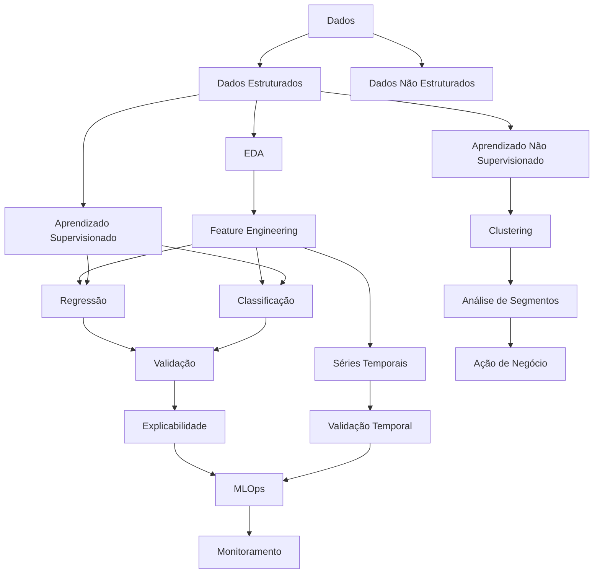
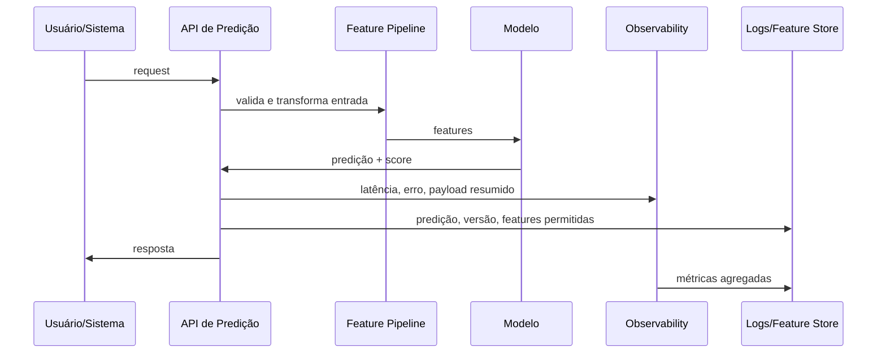
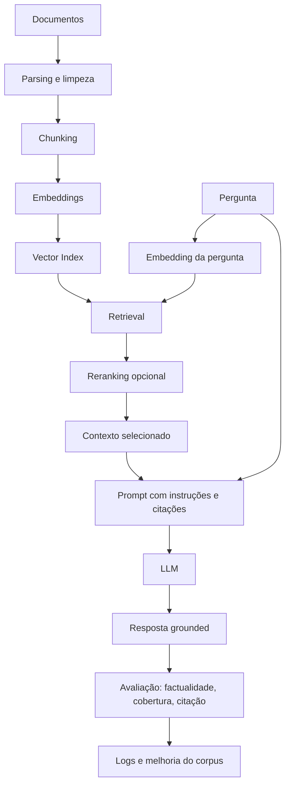
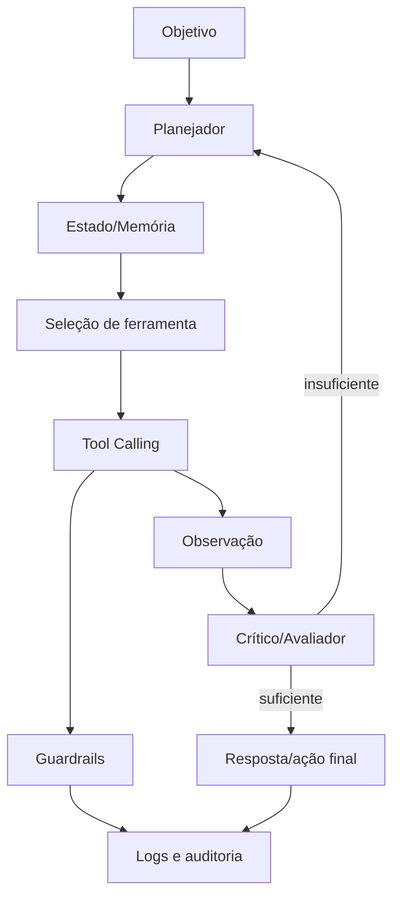
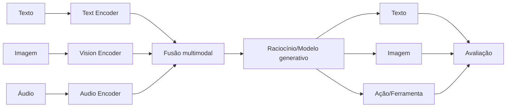
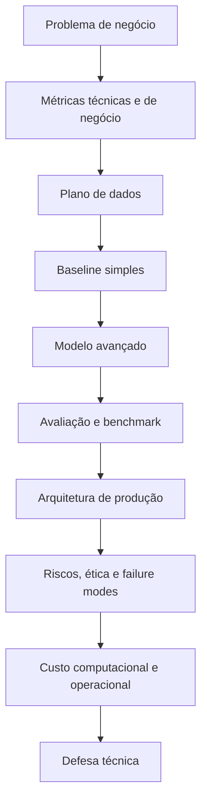

# Concept Map

Diagramas Mermaid para navegar pelas relações centrais do programa.

---

## 1. Relações Entre Conceitos

---

## 2. Arquitetura de Treinamento ML

```mermaid
flowchart LR
    Raw[Dados brutos] --> Ingest[Ingestão]
    Ingest --> Validate[Validação de schema e qualidade]
    Validate --> Split[Split treino/validação/teste]
    Split --> Transform[Preprocessamento em Pipeline]
    Transform --> Train[Treinamento]
    Train --> Tune[Tuning]
    Tune --> Eval[Avaliação]
    Eval --> Explain[Explicabilidade]
    Explain --> Registry[Model Registry]
    Registry --> Deploy[Deploy]
    Deploy --> Monitor[Monitoramento]
    Monitor --> Drift[Drift e degradação]
    Drift --> Retrain[Retreinamento controlado]
    Retrain --> Train
```

---

## 3. Serving Pipeline

---

## 4. RAG Pipeline

---

## 5. Agentic Workflow

---

## 6. Multimodal Pipeline

---

## 7. Capstone Architecture

