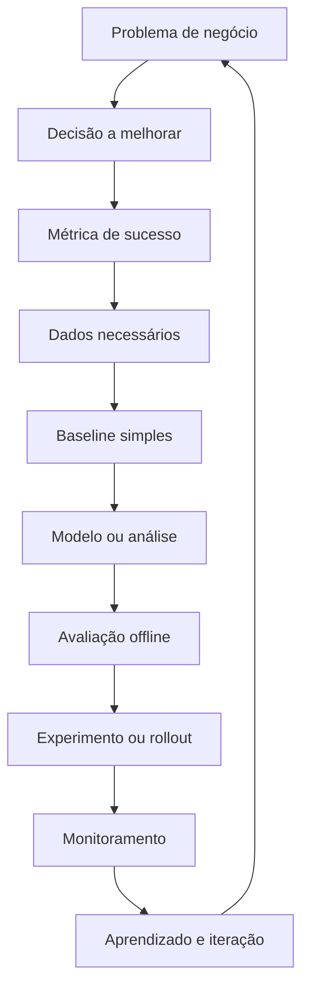
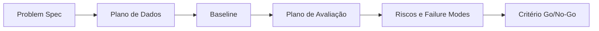

# Week 01 — Ciência de Dados, Analytics e IA

## Objetivo Técnico

Nesta semana você não treina um modelo ainda. Você aprende a transformar uma intenção vaga em um problema técnico testável. O entregável é uma especificação de problema orientado a dados, com objetivo, hipótese, dados necessários, métrica, baseline, riscos, custo e critério de decisão.

Esse passo evita o erro mais caro em Data Science: otimizar uma métrica que não representa uma decisão real.

---

## 1. Analytics, Data Science, ML, Deep Learning e GenAI

### Analytics

Analytics é o uso sistemático de dados para descrever, diagnosticar, prever ou prescrever decisões. Em termos práticos:

- **Descriptive analytics:** o que aconteceu?
- **Diagnostic analytics:** por que aconteceu?
- **Predictive analytics:** o que provavelmente acontecerá?
- **Prescriptive analytics:** o que devemos fazer?

Um projeto de Analytics pode ser altamente valioso sem Machine Learning. Muitas decisões são resolvidas com desenho correto de métrica, segmentação, análise de coorte, visualização, experimento ou estatística inferencial.

### Data Science

Data Science combina estatística, computação, conhecimento de domínio e comunicação para extrair evidência acionável de dados. A unidade de trabalho não é "um notebook"; é uma decisão ou produto que muda comportamento.

### Machine Learning

Machine Learning é apropriado quando o sistema precisa aprender padrões a partir de dados para predizer, classificar, ranquear, segmentar ou recomendar.

Formalmente, em aprendizado supervisionado, você observa pares `(x_i, y_i)` e ajusta uma função `f(x)` para minimizar uma loss:

```txt
theta* = argmin_theta (1/n) * sum_i L(f_theta(x_i), y_i) + regularizacao(theta)
```

O modelo não aprende "a verdade"; ele aprende uma aproximação condicionada ao dataset, à função de perda, às features, ao split e à distribuição observada.

### Deep Learning

Deep Learning usa redes neurais profundas para aprender representações. Ele é útil quando a representação manual é difícil: imagem, texto, áudio, sequência, multimodalidade. Em dados tabulares pequenos e médios, modelos como gradient boosting frequentemente continuam sendo baselines fortes.

### Generative AI

GenAI produz conteúdo ou ações: texto, código, imagem, áudio, planos, chamadas de ferramentas. O risco técnico muda: além de acurácia, você passa a medir factualidade, alinhamento, robustez a prompt injection, custo por token, latência, rastreabilidade e observabilidade.

---

## 2. O Ciclo de Vida de um Problema Orientado a Dados



O fluxo é iterativo. Você deve ser capaz de parar o projeto em qualquer etapa se a premissa ficar fraca.

---

## 3. Framing de Problema

Um bom framing responde:

| Pergunta | Exemplo aceitável | Exemplo fraco |
|---|---|---|
| Qual decisão muda? | "Priorizar 20% dos clientes com maior risco de churn para ação de retenção" | "Usar IA para melhorar churn" |
| Quem usa a saída? | "Time de CRM semanalmente" | "A empresa" |
| Qual unidade de predição? | "Cliente ativo no último dia do mês" | "Dados de clientes" |
| Qual horizonte? | "Churn nos próximos 30 dias" | "Churn futuro" |
| Qual baseline? | "Regra: clientes sem compra há 60 dias" | "Sem baseline" |
| Qual métrica técnica? | "AUC, recall@20%, precision@20%" | "Acurácia" |
| Qual métrica de negócio? | "Receita retida líquida por campanha" | "Modelo melhor" |
| Qual custo de erro? | "Falso positivo custa desconto; falso negativo custa perda de cliente" | "Erros são ruins" |

---

## 4. Métrica Técnica vs Métrica de Negócio

Métrica técnica avalia comportamento do modelo. Métrica de negócio avalia consequência da decisão.

Exemplo de churn:

- **Métrica técnica:** recall@k, precision@k, AUC, calibration.
- **Métrica de negócio:** retenção incremental, margem preservada, custo de campanha, ROI.

Um modelo com AUC maior pode gerar menor valor se for mal calibrado, se o threshold for ruim ou se a ação de negócio for cara demais.

---

## 5. Baseline

Baseline é o menor sistema honesto que permite comparação. Pode ser:

- regra de negócio;
- média histórica;
- modelo linear simples;
- previsão naive em séries temporais;
- prompt zero-shot controlado;
- busca lexical antes de RAG.

Sem baseline você não sabe se o modelo sofisticado adicionou valor ou apenas complexidade.

Critérios de um baseline útil:

- fácil de explicar;
- barato de rodar;
- reproduzível;
- avaliado com o mesmo split e a mesma métrica do modelo avançado;
- forte o suficiente para constranger soluções fracas.

---

## 6. Dados, Rótulo e Leakage

Antes de pensar em algoritmo, defina:

- **entidade:** cliente, transação, produto, documento, sessão;
- **observação:** uma linha representa o quê?
- **timestamp de observação:** quando as features ficam conhecidas?
- **target:** o que será previsto?
- **horizonte:** target medido em qual janela?
- **features permitidas:** quais variáveis existiam no momento da decisão?

Leakage ocorre quando a validação usa informação que não existiria no momento real. Exemplo: prever churn de 30 dias usando uma coluna atualizada depois do cancelamento.

---

## 7. Correlação, Causalidade e Acurácia

### Correlação

Correlação mede associação estatística. Não prova causalidade. Uma feature pode ser preditiva por ser proxy de outra causa, por vazamento ou por viés operacional.

### Causalidade

Causalidade exige desenho mais forte: experimento, quase-experimento, variáveis instrumentais, controles ou hipóteses causais explícitas. Modelos preditivos podem apoiar decisões sem explicar causa.

### Acurácia

Acurácia é frequentemente inadequada em classes desbalanceadas. Se 98% dos clientes não churnam, um classificador que sempre prevê "não churn" tem 98% de acurácia e valor operacional quase nulo.

---

## 8. Arquitetura Mínima de Projeto



Na Semana 01, você entrega essa arquitetura em documento. Código só entra para validar ambiente e estruturar o template.

---

## 9. Failure Modes Iniciais

| Falha | Sintoma | Prevenção |
|---|---|---|
| Problema vago | "usar IA" sem decisão | escrever decisão, usuário e ação |
| Métrica proxy ruim | modelo melhora e negócio não | separar métrica técnica e de negócio |
| Target mal definido | rótulo muda dependendo da extração | definir entidade, janela e timestamp |
| Leakage | métrica offline irreal | simular tempo real no split |
| Baseline ausente | não há comparação | criar regra simples antes do modelo |
| Custo ignorado | solução inviável em produção | estimar custo computacional e operacional |
| Viés operacional | modelo reforça erro histórico | auditar dados, segmentos e impacto |

---

## 10. Critério de Prontidão da Semana

Você concluiu a semana se consegue defender, sem mencionar algoritmo primeiro:

1. qual decisão será melhorada;
2. qual métrica provará melhora;
3. quais dados são necessários e quando existem;
4. qual baseline será usado;
5. quais erros custam mais;
6. quais riscos tornam o projeto inviável;
7. por que o problema exige Analytics, ML, DL ou GenAI.
